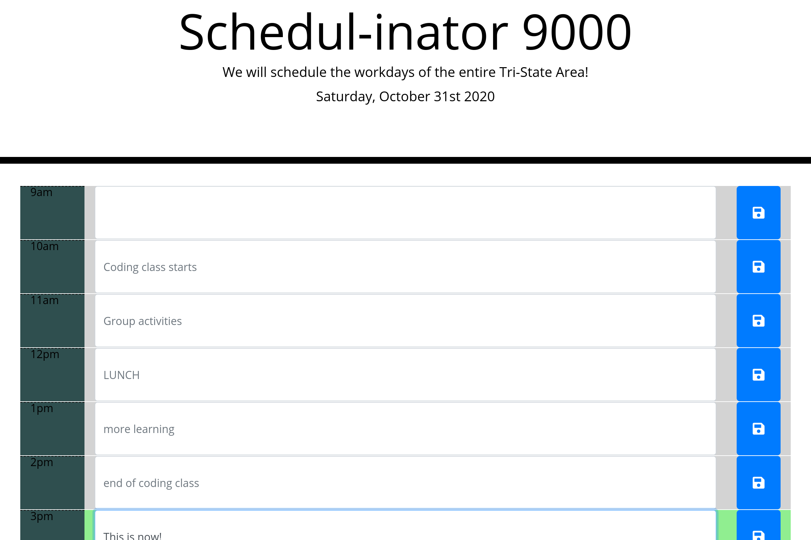

# Schedulinator 9000

### AKA 05 Third-Party APIs: Work Day Scheduler

## Description
This project is a basic webpage made to help schedule out a workday in an hourly fashion. This project was made to focus on manipulating HTML, CSS, and localStorage using jquery as well as learning how to use a new API in moment.js.

## Installation
In order to use this website, you may downlaod it here https://github.com/DaronSchmit/DaronDayScheduler/archive/main.zip this will require you to unzip it, but you only have to open index.html to get started.

Otherwise, a user may go to  https://daronschmit.github.io/DaronDayScheduler/ to see the webpage deployed live, or to the GitHub repository at https://github.com/DaronSchmit/DaronDayScheduler.

## Usage
This webpage displays normal work hours and will change colors based on if a work hour is in the past, present, or future. Users may also enter anything into the text input area and press the save button in order to save their event and have it persist between page reloads. If a user wants to clear them, they only have to clear out the text and save again.

## Credits
Big credits to Trilogy and university of minnesota coding bootcamp put on by Charlie Werness for the bones of this project and the guidance to get through it.

##License
This is published under MIT license, but is subject for Trilogy's All Rights Reserved.